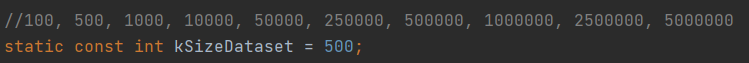
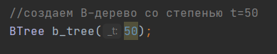
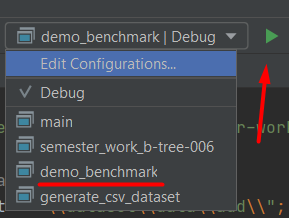

# B-Tree

[](https://github.com/Algorithms-and-Data-Structures-2021/semester-work-b-tree-006/actions/workflows/cmake.yml)


- Структура данных - **B-tree**
- **B-tree** - сильноветвящееся сбалансированное дерево поиска. Они созданы специально для эффективной работы с дисковой памятью.
- **B-tree** имеет следующие свойства (**t** — параметр дерева, называемый минимальной степенью B-tree, не меньший **2**.):
  - Каждый узел содержит хотя бы один ключ. Корень содержит от **1** до **2t-1** ключей. Любой другой узел содержит от **t-1** до **2t-1** ключей. Листья не являются исключением из этого правила.
  - У листьев потомков нет. Любой другой узел, содержащий **n** ключей, содержит **n+1** потомков. При этом:
    - Первый потомок и все его потомки содержат ключи из интервала **(-∞; K<sub>1</sub>)**;
    - Для **2≤i≤ n**, **i**-й потомок и все его потомки содержат ключи из интервала **(K<sub>i-1</sub>; K<sub>i</sub>)**;
    - **(n+1)**-й потомок и все его потомки содержат ключи из интервала **(K<sub>n</sub>; ∞)**.
  - Глубина всех листьев одинакова.
- **Операции**:
  - Поиск ключа - **O(tlog<sub>t</sub>n)**
  - Добавление ключа - **O(tlog<sub>t</sub>n)**
  - Разбиение узла
  - Удаление ключа - **O(tlog<sub>t</sub>n)**
    - Удаление ключа из листа
    - Удаление ключа из внутреннего узла
    - Перемещение ключа
    - Слияние
- **B-Tree** широко используется в базах данных и файловых системах (например: NTFS, HFS+, ext4) 

## <team_name>

| Фамилия Имя   | Вклад (%) | Прозвище              |
| :---          |   ---:    |  ---:                 |
| Илья Калимуллин   | 33,3        |  _ilya_               |
| Булат Сунгатуллин   | 33,3        |  _bulat_ |
| Паша Шумбасов   | 33,3        |  _pasha_         |

**Девиз команды**
> _В этой жизни ты либо волк, либо не волк☝_

## Структура проекта

Проект состоит из следующих частей:

- [`src`](src)/[`include`](include) - реализация структуры данных (исходный код и заголовочные файлы);
- [`benchmark`](benchmark) - контрольные тесты производительности структуры данных (операции добавления, удаления,
  поиска и пр.);
- [`examples`](examples) - примеры работы со структурой данных;
- [`dataset`](dataset) - наборы данных для запуска контрольных тестов и их генерация;


## Требования (Prerequisites)

Рекомендуемые требования:

1. С++ компилятор c поддержкой стандарта C++17 (например, _GNU GCC 8.1.x_ и выше).
2. Система автоматизации сборки _CMake_ (версия _3.12.x_ и выше).
3. Clion или Visual Microsoft Visual Studio.
4. Рекомендуемый объем оперативной памяти - не менее 4 ГБ.
5. Свободное дисковое пространство объемом ~ 3 ГБ (набор данных для контрольных тестов).

## Сборка и запуск

### Пример (с использованием IDE CLion)

#### Сборка проекта
- 1 способ:
  - Склонируйте проект к себе на устройство через [Git for Windows](https://gitforwindows.org/):
  ```shell
  git clone https://github.com/Algorithms-and-Data-Structures-2021/semester-work-b-tree-006.git
  ```
    
- 2 способ:
  - Откройте проект в [CLion](https://www.jetbrains.com/ru-ru/clion/), используя URL:
  ```shell
  https://github.com/Algorithms-and-Data-Structures-2021/semester-work-b-tree-006.git
  ```
    
  
#### Генерация тестовых данных

Генерация тестового набора данных в
формате [Text file(TXT)](https://en.wikipedia.org/wiki/Text_file):

- Процесс генерации тестовых данных:
  - откройте проект в [CLion](https://www.jetbrains.com/ru-ru/clion/)  
  - перейдите в dataset и откройте **generate_csv_dataset.cpp**  
  
  - определите путь до проекта  
  
  - пропишите максимальное значение элементов(по желанию)  
  
  - запустите **generate_csv_dataset.cpp**  
  
  - подождите пока сгенерируются все данные  
  

Тестовые данные представлены в TXT формате (см.
[`dataset/data/dataset-example.txt`](dataset/data/dataset-example.txt)):

```txt
654
44
78
132
256
...
```

**Примечание**. Данные для удобства запуска контрольных тестов организовываются так:

```shell
dataset/data/
  add/
    01/
      100.txt
      ...
      5000000.txt
    02/ ...
    03/ ...
    ...
    10/ ...
  search/
    01/
      100.txt
      ...
      5000000.txt
    ...
    10/ ...
  ...
```

По названию директории `/dataset/data/add` можно понять, что здесь хранятся наборы данных для контрольных тестов по
**добавлению** элементов в структуру данных. Названия файлов `100.txt`. `5000000.txt` и т.д. хранят информацию о размере набора данных (т.е. количество элементов). 

#### Контрольные тесты (benchmarks)

- Процесс измерения по времени тестовых данных:
  - Для запуска контрольных тестов необходимо предварительно сгенерировать или скачать готовый набор тестовых данных(data) по [ссылке](https://drive.google.com/drive/folders/18TU3Hrlns-WvWv0du2pRgy5E4uMpS2wx).
  - откройте проект в [CLion](https://www.jetbrains.com/ru-ru/clion/)  
  - при скачивании набора замените папку data новым скаченным data  
  - перейдите в benchmark и откройте **demo_benchmark.cpp**  
  
  - определите путь до проекта  
   
  - определите размер данных, которые тестируете  
   
  - по желанию можете изменить степень дерева    
   
  - запустите **demo_benchmark.cpp**  
  
  - подождите пока тест пройдут все данные  
  


##### Список контрольных тестов

| Название                  | Описание                                | Метрики    |
| :---                      | ---                                     | :---       |
| `add`                     | добавление элементов в структуру данных | _время_    |
| `search`                  | поиск элементов по случайному индексу   | _время_    |
| `remove`                  | удаление элементов в структуру данных   | _время_    |


## Примечание  
С презентацией, видео-презентацией, отчетом, готовым набором тестовых данных, графиками производительности можете ознакомиться, перейдя по ссылке на [Google Drive](https://drive.google.com/drive/folders/18TU3Hrlns-WvWv0du2pRgy5E4uMpS2wx). 

## Источники

1. YouTube канал “NeuralNine”, видео https://youtu.be/hMGhs63sCO0.  

2. YouTube канал “Volodya Mozhenkov”, видео https://youtu.be/WXXetwePSRk.  

3. Статьи с сайта habr, в основном https://habr.com/ru/post/114154/.

